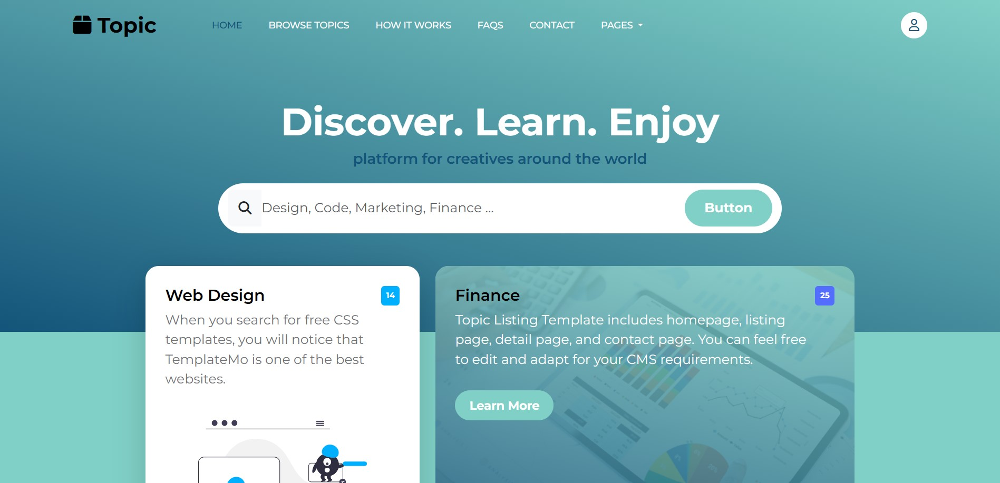
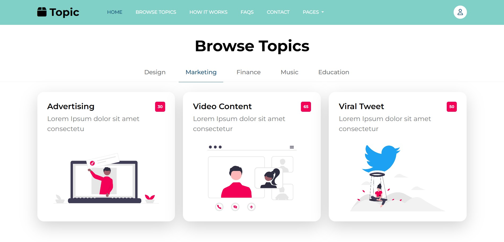

# CreativeTopics – Educational & Inspirational Landing Page

CreativeTopics is a fully re-developed landing page built from scratch based on a web template found online.  
This modern, responsive, and user-friendly template is designed for educational content and creative inspiration.

## 🚀 Features

- 🔍 Smart search bar for topics like Web Design, Finance, Graphic Arts
- 📚 Clean and stylish topic cards
- 🧭 "How it works" section for user guidance
- ❓ FAQ accordion with interactive dropdowns
- 📍 Contact section with Google Maps integration
- 🌐 Fully responsive and mobile-friendly design

## 🛠️ Technologies Used

- [Vite](https://vitejs.dev/) – Project management and fast development
- HTML5
- CSS3
- Bootstrap 5
- JavaScript (Vanilla)

## 📂 Project Goal

This project was developed as a personal frontend practice to enhance development skills.  
The entire layout was **re-created from scratch** and customized based on a free template available online.  
Improvements were made to structure, responsiveness, and code organization.

## 📸 Preview

## 🌍 Live Demo

[Here](https://creative-topics-educational-inspirational-landing-page.vercel.app/)

## 📬 Contact

If you like this project or want something similar, feel free to reach out!  
Email: contactme.abdelilah@gmail.com  

---

### 🗨️ Arabic Description

قمت بإعادة تطوير هذا القالب بالكامل من الصفر بالاعتماد على قالب موجود على الويب، مع تحسينات في الأداء والتنظيم والتوافق مع جميع الشاشات.

تم استخدام **Vite** لإدارة المشروع، و**HTML5** و**CSS3** و**Bootstrap** و**JavaScript** في بناء الواجهة.

**مميزات القالب:**
- شريط بحث ذكي للمواضيع مثل تصميم المواقع، المالية، والفنون  
- بطاقات مواضيع مرتبة مع تأثيرات بصرية  
- قسم "كيف يعمل" لشرح خطوات الاستخدام  
- قسم الأسئلة الشائعة FAQ  
- معلومات تواصل مدمجة مع خريطة Google

---

